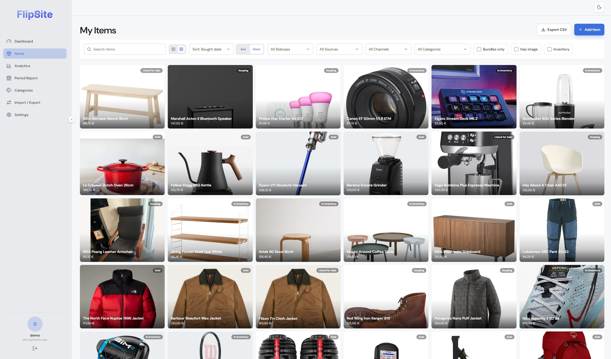
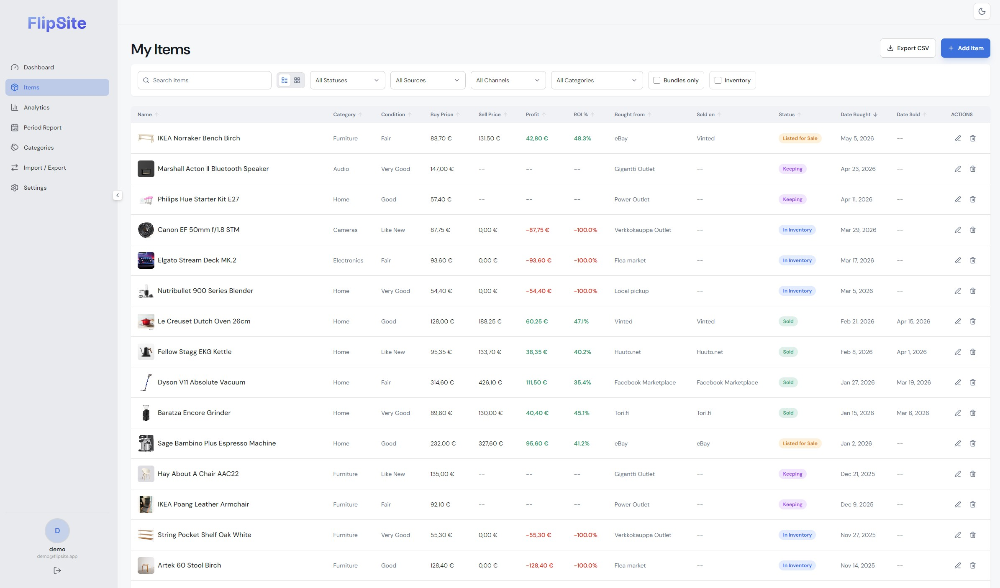
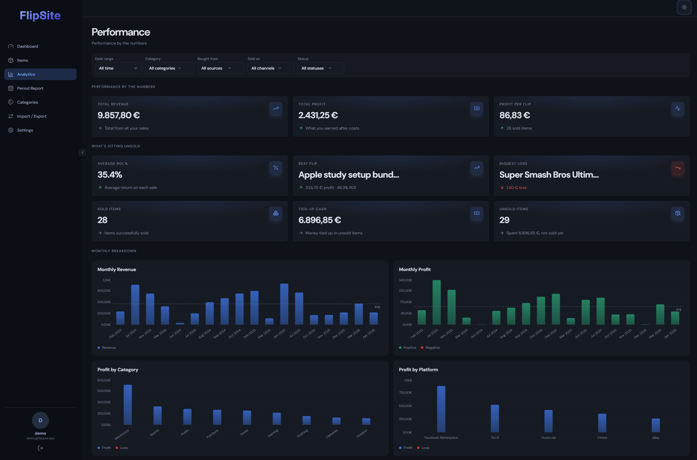

I was tracking my resale items in a spreadsheet and it kept falling apart in exactly the ways spreadsheets fall apart. Bundle math was unreliable, receipts lived in my email, photos were scattered across my phone, and the profit numbers always felt slightly off. At some point I decided fixing the spreadsheet wasn't worth it and building a proper tool was.

FlipSite replaced the spreadsheet. Now I use it every day.

## What's in it

The dashboard shows nine KPI cards and four charts at a glance — total inventory value, realised profit, average ROI, hold times. Items flagged as **keeping** are tracked separately so they don't drag down the resale numbers; a record of what something is worth sits next to the record of what you made flipping other things.

Everything in your inventory lives in the items list. You can browse it as a table with sortable columns and profit per row, or switch to gallery view and navigate by photo — which is usually how you actually think about physical stuff. Each item holds its category, condition, buy and sell price, platform, status, dates, notes, and any attached files like receipts or manuals.

## Bundles

The part that finally made the spreadsheet unusable: buying a collection for one price and selling the pieces separately. FlipSite handles this with bundles — you record the kit purchase once, then each child item tracks its own sale while the whole thing accounts for what you originally spent. You get the actual number you walked away with, not a rough guess.

## Analytics

The analytics page lets you filter by date range and platform, and every number on the page responds. The hold time vs profit scatter makes it immediately obvious whether flipping fast or sitting on things is working better for you. A cumulative profit line compared against a steady-pace baseline shows whether your returns are accelerating or leveling off. Useful for questions like "how did camera gear do last quarter" or "is this platform actually worth the fees."

## Why it stuck

The next useful improvements would be CSV export, bulk import, and price history notes. Those would make it easier to move from an existing spreadsheet and track listing changes over time.

The main success metric for FlipSite is simple: I still use it. That shaped a lot of small decisions. Adding an item has to be fast enough that I will actually do it after buying something. Sold items need to remain visible because past flips are often the best reference for pricing future ones. Files and notes sit directly on the item record because separating receipts from the thing they describe is how the old spreadsheet became unreliable.

The Supabase backend is intentionally modest. Authentication, rows, file storage, and enough relational structure to keep bundles and items connected. I avoided turning it into accounting software because the value is in keeping resale decisions clear, not modelling every possible edge case.

## The personal touches

Eight color themes, each with independent light and dark mode — from Midnight Drop and Cold Brew to Neon Petal and Colorful 80s. Six font options. None of this is necessary for a resale tracker, but it made it considerably more enjoyable to open every day.

The live demo is at [flipsite-three.vercel.app](https://flipsite-three.vercel.app/) — log in with `demo@flipsite.app` / `demo1234` to poke around a seeded inventory with real bundle examples and realistic prices.
