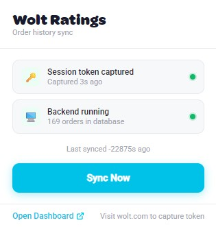
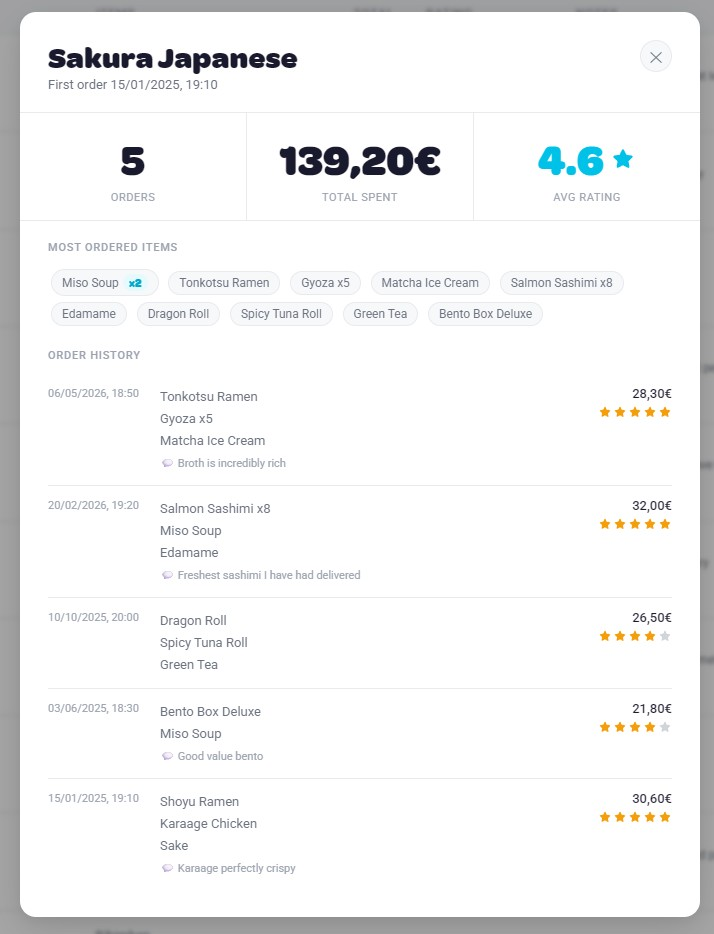

I order food through Wolt a lot. At some point I started noticing a familiar frustration — I couldn't remember whether that ramen place was actually great or just good-enough-at-midnight, or how much I'd spent at my favorite sushi spot across all the times I'd been there. Wolt's order history gives you a reverse-chronological list of receipts and nothing else. No ratings, no notes, no stats. It's a graveyard of decisions with no lessons attached.

So I built **Wolt Ratings** to fix that for myself.

## What it does

The idea is simple: pull your entire Wolt order history out of Wolt's API and give it a proper home on your own machine. From there you get a full dashboard where you can search by venue or dish, sort and filter however you want, rate any order with one to five stars, and attach a personal note to remember what was good, what to avoid, or what to order next time.

The thing I use most is the **per-venue view** — collapse the list down to one row per restaurant and you immediately see your total spend there, your average rating across every visit, and how long you've been going. It reframes your order history as a record of your relationship with each place rather than just a list of transactions.

Clicking into any venue opens a detail modal with the full picture: total spend, average rating, the items you've ordered most, and a timeline of every visit with its own star rating. It's the kind of view that makes you realize you've ordered from the same Thai place 23 times and never rated it once.

## The Chrome extension

The extension is the invisible half of the project. It sits quietly in the background and watches for outgoing API requests while you browse Wolt, picking up your session token from the request headers. Once it has a valid token, it lights up green in the popup and you hit **Sync Now** — that's it. The extension sends your orders to a local Flask backend running on your machine, which stores everything in a plain JSON file.

No data ever leaves your machine. There's no account to create, no server to trust, no subscription. The JSON file is yours to back up, export, or delete whenever you want. There's even a demo mode that loads example data so you can explore the dashboard without syncing anything real.

## The stats bar

One small thing I'm proud of: the live stats bar at the top of the dashboard. It shows your total orders, total spend, average order value, average rating, top venue by visit count, and how many orders are still unrated — and all of it responds in real time to whatever filters you have active. Filter to a single year and the numbers instantly reflect just that period. It turns the dashboard from a passive list into something that actually tells you something.

## Why local-first

I briefly considered making this a proper web app with user accounts and cloud storage, and then immediately decided against it. Your food order history is surprisingly personal data — it maps your schedule, your neighborhood, your habits, your budget. The local-first approach isn't just a technical choice, it's the right one. Everything runs on your machine, syncs to your machine, and stays on your machine.

The full source is on GitHub if you want to run it yourself or poke around the code: [Wolt Ratings on GitHub](https://github.com/avollrath/wolt-ratings)
