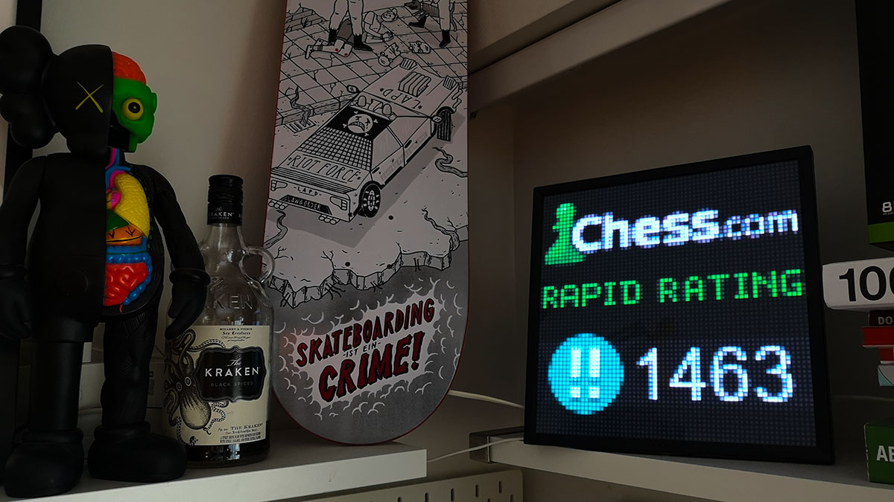

I like small projects that combine different interests. In this case it was **chess, programming, and hardware**.

After playing a lot of games on Chess.com, I had the idea to display my current rating on a small shelf display so I could see it update over time.

That’s where the **Pixoo pixel display** came in.

The goal was simple: fetch my rating from the Chess.com API and show it on the Pixoo screen.

---

## The Idea

Instead of checking my rating manually on Chess.com, I wanted a small device on my shelf that always shows my current rating.

The system works like this:

1. Fetch rating data from the **Chess.com API**
2. Format the rating as a small image
3. Send the image to the **Pixoo display**

The result is a tiny dashboard that updates automatically.

---

## Fetching Data from Chess.com

Chess.com provides a public API that exposes player statistics.  
The endpoint used for this project is:

    https://api.chess.com/pub/player/{username}/stats

This returns rating information for different game modes such as:

- blitz
- rapid
- bullet
- daily

Using Python and the `requests` library, fetching the data is straightforward.

Example:

    import requests

    def fetch_chess_stats(username):
        url = f"https://api.chess.com/pub/player/{username}/stats"
        headers = {"User-Agent": "ChessRatingDisplay"}
        response = requests.get(url, headers=headers)

        if response.status_code == 200:
            return response.json()

        return None

From the returned JSON, I extract the rating value for the game mode I want to display.

---

## Rendering the Display

The Pixoo display works by receiving small images over the network.

Instead of sending raw text, the script generates a small image containing the rating and sends it to the device.

This gives full control over:

- font
- layout
- colors
- icons

Because the display is low resolution, the design has to stay simple so the information remains readable.

---

## Updating the Rating

The script runs periodically and fetches the latest rating from Chess.com.

When the rating changes, the display updates automatically.

This creates a small live indicator of how my rating evolves over time.

---

## Why I Like This Project

Projects like this sit somewhere between **software development and hardware tinkering**, which makes them especially fun.

It’s also a nice reminder that programming doesn’t always have to result in websites or apps. Sometimes a few lines of code and a small device can turn into something surprisingly satisfying.

---

## Final Thoughts

This project combines:

- a public API
- a small Python script
- a pixel display on my shelf

The result is a simple but fun way to keep track of my chess rating.

And it’s a great example of how small hobby projects can turn everyday interests into little pieces of custom hardware.

---

_The Pixoo display showing my current Chess.com rating._
