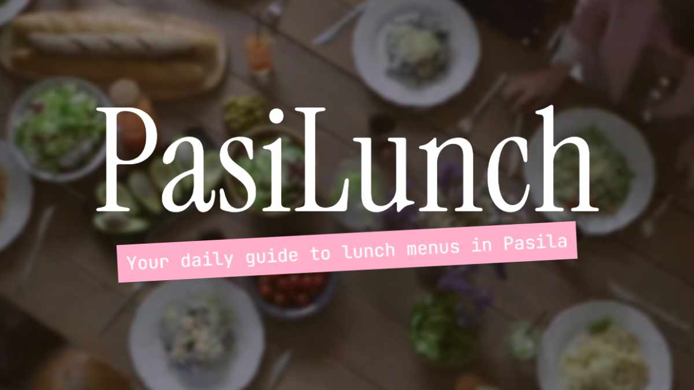

# Building a Next-Gen LunchBot for Slack & Web

## Introduction

A few years ago, I built a Slack bot to fetch and display lunch menus from restaurants near my office. It worked well, but it was a simple script. Over time, I wanted more: a real-time web interface, better caching, and a smoother Slack integration. So, I revamped the whole project. Meet the new **PasiLunch LunchBot** – a powerful, fun, and efficient way to check what's for lunch!

## Features

- 🏢 **Slack Command** (`/lunch`) – Fetches the daily lunch menus and posts them in Slack with a witty message.
- 🌐 **Web Dashboard** – A sleek, auto-updating website that displays all available menus.
- ⚡ **Fast Caching** – Stores menus locally to prevent unnecessary scrapes and API requests.
- 🤖 **Fun & Engaging** – The bot serves its menus with humorous messages to lighten up your day.
- 🔄 **Keep-Alive Mechanism** – Prevents the bot from sleeping on free hosting platforms.

## Tech Stack

- **Node.js** – The backbone of the bot.
- **Express.js** – Powers the web dashboard.
- **Cheerio.js** – Scrapes menus from restaurant websites.
- **Slack API** – Handles the `/lunch` command responses.
- **Axios** – Fetches data from APIs and restaurant pages.
- **JSON File Storage** – Caches menus locally for quick responses.

## How It Works

### 1️⃣ Fetching Menus

LunchBot scrapes menus from various restaurants using custom-built scrapers. Some menus are in HTML, some in JSON, and some even in XML. Each restaurant has a dedicated function to extract data.

### 2️⃣ Caching Mechanism

The bot saves each menu to a JSON file along with the current date. If a request comes in on the same day, it serves the cached menu instead of re-fetching it. This improves performance and prevents overloading restaurant websites.

### 3️⃣ Slack Integration

Users in our Slack workspace can simply type `/lunch`, and LunchBot responds with the day’s menu options in a neatly formatted message. The bot also keeps track of how many Slack requests it has handled!

### 4️⃣ Web Dashboard

LunchBot also serves a web page that displays all the menus in a beautiful, structured way. It updates automatically and includes a fun animated header.

## Challenges & Learnings

- **Scraping Complexity** 🏗️ – Each restaurant’s website had a different structure, requiring unique parsing logic.
- **Keeping It Fresh** 🔄 – Some sites changed frequently, breaking the scrapers. Error handling and fallbacks were crucial.
- **Slack Formatting** 💬 – Slack’s markdown-like syntax needed careful formatting to ensure menus displayed correctly.

## Try It Out!

- Visit **[LunchBot Web Dashboard](https://lunchbot-btnu.onrender.com/)** 🌐

This project has been a blast to build, and it’s now a daily essential for our office. Let me know if you want to build something similar – always happy to share insights! 🚀

_The LunchBot project aims to streamline workplace communication and dining decisions._
