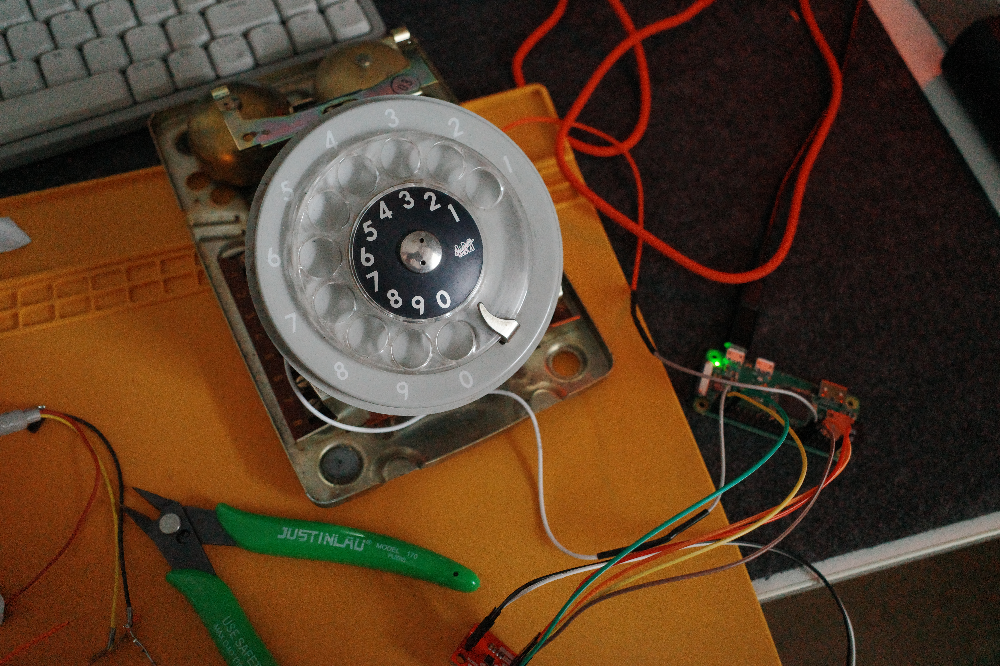
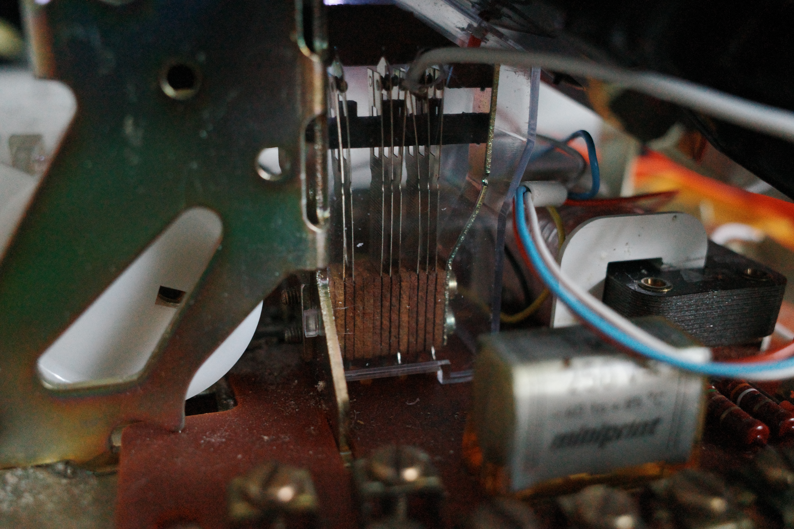
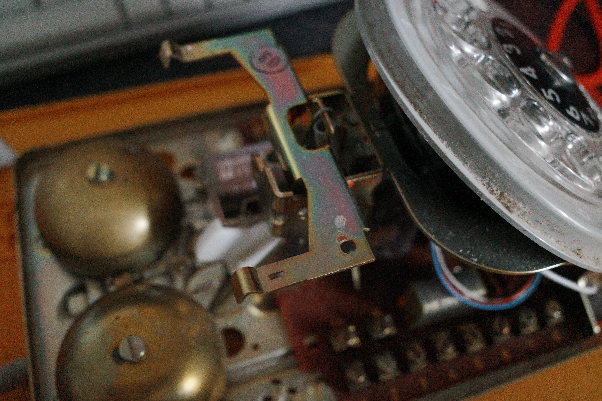
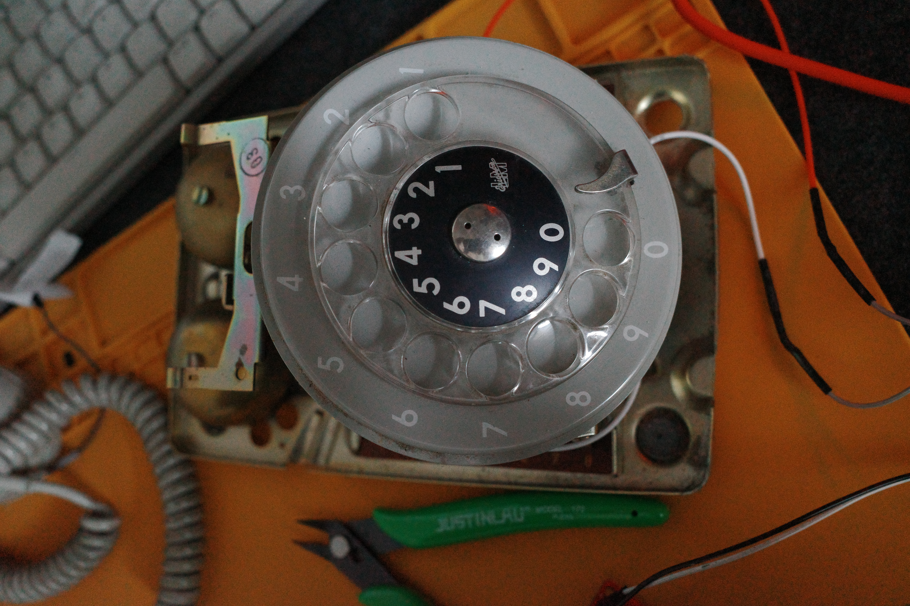
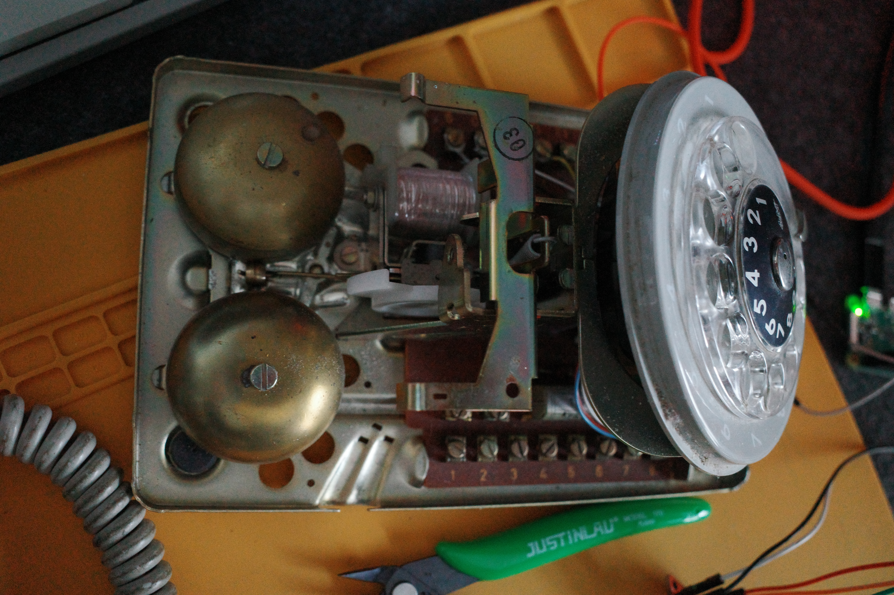
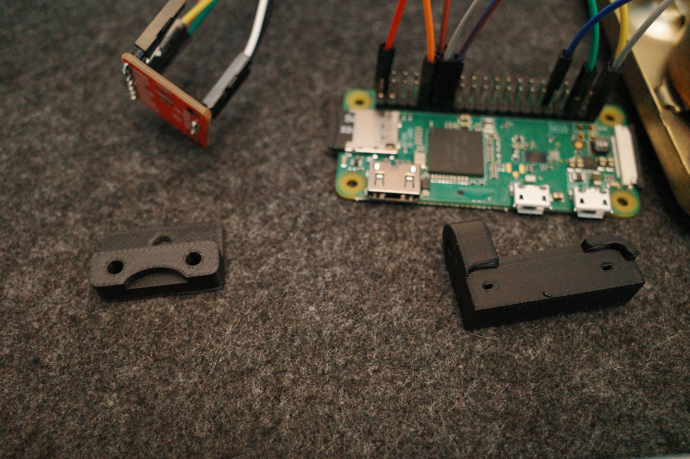
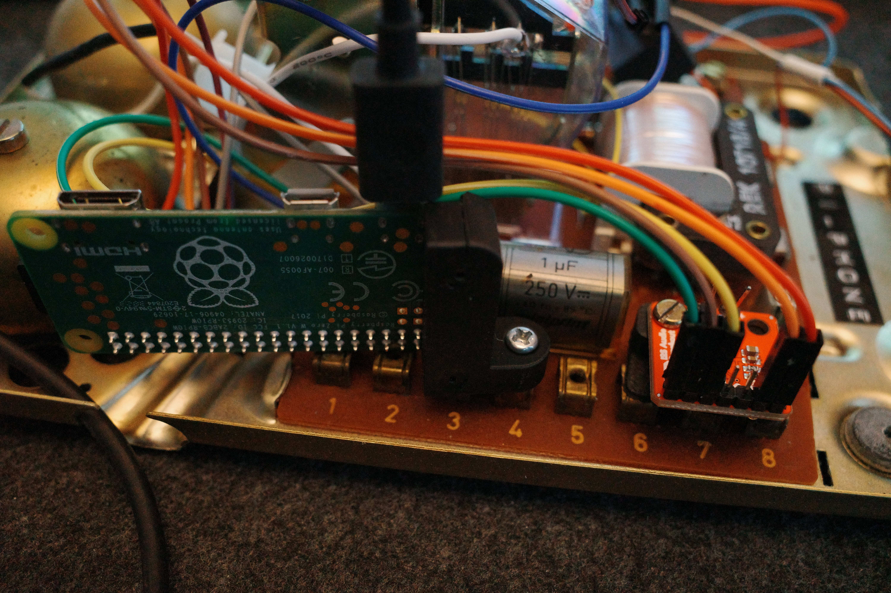
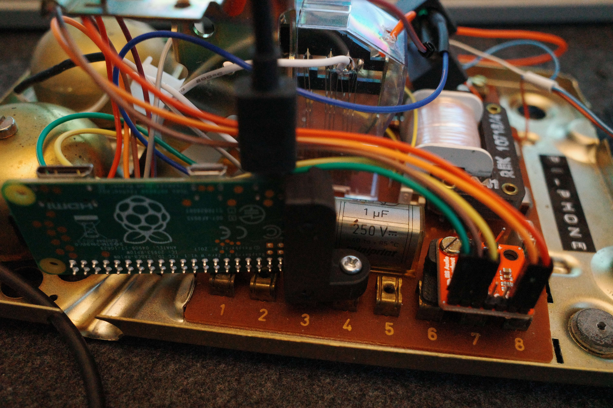
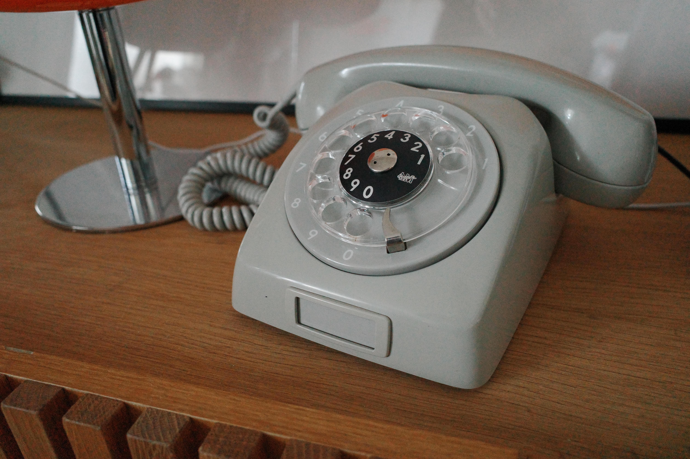

Most streaming audio begins with a screen: unlock a device, open an application, search, choose, and press play. I wanted to remove that sequence and make the interaction physical.

PiPhone is a retro rotary telephone rebuilt as an automatic poetry player. Lifting the handset, or using a small toggle switch during testing, starts a Python process that selects a random audio poem from a public feed and plays it through the telephone's speaker. There is no display, browser, or desktop session. The phone is the interface.



## Starting with the Telephone

The first job was understanding how much of the original telephone could remain. Under the plastic shell is a dense mechanical assembly: the rotary dial, switch contacts, bells, springs, terminal strips, and the cradle mechanism used to detect whether the handset is resting in place.





I kept the parts that gave the phone its physical behavior and worked around them. The handset still sits on the original cradle. The dial still turns with its measured mechanical return. The new electronics had to occupy the remaining space without preventing either mechanism from moving.

That constraint shaped the build more than the software did. A script can be changed in seconds. A Raspberry Pi mounted a few millimeters too high can stop the case from closing.





## Fitting New Hardware into the Old Chassis

The host is a Raspberry Pi running a minimal, headless Debian-based operating system. It boots directly into the audio service and does not need a monitor, keyboard, or graphical environment.

I designed and 3D printed small mounting parts for the Pi and amplifier rather than drilling arbitrary holes into the telephone. The printed pieces locate the boards against existing structures, provide electrical separation from the metal chassis, and keep connectors accessible while the phone is open.



The mounts are visually unimportant once the shell is closed, but mechanically they are the part that makes the conversion feel finished. Loose boards and adhesive would have worked for a prototype. Fixed mounting makes the wiring repeatable and lets the phone be moved without components shifting into the dial mechanism.

## Digital Audio over I2S

The Pi sends audio over I2S to a SparkFun MAX98357A mono amplifier breakout. This keeps the signal digital until it reaches the amplifier and avoids relying on a noisy analog output inside a crowded metal enclosure.

The essential connections are:

- Pi power and ground to the amplifier
- I2S bit clock from the Pi GPIO header
- I2S left/right clock from the Pi GPIO header
- I2S serial data from the Pi GPIO header
- amplified mono output to the telephone speaker

The MAX98357A combines the digital-to-analog conversion and speaker amplification on one small board. That made it a practical fit for the limited space inside the phone.





### ALSA and the Device Tree

Linux still needs to expose the I2S hardware as a usable sound card. I configured the generic I2S driver through the system device tree overlay. Once loaded, ALSA identifies the output through the `snd_rpi_hifiberry_dac` driver, with `pcm5102a-hifi-0` as the playback interface on Card 0.

The useful checks were deliberately low-level:

```bash
aplay -l
cat /proc/asound/cards
alsamixer -c 0
```

`aplay -l` confirmed that the kernel had created the expected playback device. `/proc/asound/cards` made the stable ALSA card name visible. `alsamixer -c 0` was useful while checking whether a mixer control or volume limit existed on the selected card. With simple I2S DAC and amplifier hardware, volume may need to be controlled in the player rather than through a conventional hardware mixer.

The important part was to stop relying on whichever device Linux happened to consider the default. The application targets the card by name:

```text
alsa/sysdefault:CARD=sndrpihifiberry
```

That explicit destination removed ambiguity during boot and prevented playback from silently moving to another output.

## Reading the Audio Feed Directly

I did not want to automate a browser or parse a rendered web page. Those layers add JavaScript, layout changes, consent screens, and request behavior that has nothing to do with retrieving an audio file.

The source already publishes a public XML distribution feed. Python can request that document directly, inspect its items, and extract the media URL from an `<enclosure>` element.

The data path is small:

```text
public XML feed
        |
requests
        |
BeautifulSoup + lxml
        |
random item
        |
<enclosure url="...mp3">
        |
mpv
```

The core parsing logic looks like this:

```python
import html
import random

import requests
from bs4 import BeautifulSoup


def get_random_audio_url(feed_url: str) -> str:
    response = requests.get(feed_url, timeout=15)
    response.raise_for_status()

    feed = BeautifulSoup(response.content, "lxml-xml")
    items = feed.find_all("item")
    if not items:
        raise RuntimeError("Feed contains no audio items")

    item = random.choice(items)
    enclosure = item.find("enclosure")
    if enclosure is None or not enclosure.get("url"):
        raise RuntimeError("Selected item has no enclosure URL")

    return html.unescape(enclosure["url"])
```

`requests` fetches the raw feed. `BeautifulSoup`, using the `lxml` XML parser, navigates the document without depending on the website's front end. A random item is selected from the complete pool, then its direct `.mp3` URL is read from the enclosure.

The final `html.unescape` step matters. Feed URLs often encode query-string separators as `&amp;`. Converting those entities back to `&` gives `mpv` the actual authorization URL rather than an XML-safe representation of it.

## Playing through the Exact ALSA Device

Playback is delegated to `mpv`. It already handles remote media, buffering, and common audio formats well, so the Python process does not need to become a media framework.

```python
import subprocess


def play_audio(audio_url: str) -> None:
    subprocess.run(
        [
            "mpv",
            "--no-video",
            "--ao=alsa",
            "--audio-device=alsa/sysdefault:CARD=sndrpihifiberry",
            audio_url,
        ],
        check=True,
    )
```

Each flag has a narrow purpose:

- `--no-video` keeps the process audio-only.
- `--ao=alsa` bypasses desktop audio layers and sends output through ALSA.
- `--audio-device=alsa/sysdefault:CARD=sndrpihifiberry` fixes playback to the configured I2S card.

Running `mpv` as a subprocess also gives the control script a clear lifecycle. Playback begins immediately, the Python process waits while the poem runs, and the subprocess exit status reports whether the stream completed normally.

## The Handset as the Interface

The final control loop is intentionally plain. A GPIO input represents the cradle or toggle state. When the contact changes into the active position, the script requests the feed, chooses a poem, and starts `mpv`.

The hardware provides the state; the script translates that state into one action. There is no menu and no remembered queue. Each lift starts with the feed as it exists at that moment.

This is also where switch debouncing and process control matter. Mechanical contacts do not produce one mathematically clean transition, so the input needs a short debounce interval. The script also guards against starting a second player while one is already active. Those details are small, but they separate a bench demonstration from an object that can sit in a room and behave predictably.

## Closing the Case

The most time-consuming part was not XML parsing or launching `mpv`. It was fitting contemporary boards around hardware designed for a completely different electrical system: measuring clearances, printing another mount, shortening a wire, tracing an ALSA card name, closing the case, and finding the one point of interference.

That friction is the point of the project. The finished phone hides nearly all of the work. It looks like a familiar object and asks for a familiar gesture. Lift the handset and a random voice begins speaking.



There is something satisfying about making old hardware speak a modern digital protocol without covering it in a new interface. The rotary dial remains a rotary dial. The handset remains the control. Behind them, a small Linux system reads XML, resolves a direct stream, and moves digital audio through GPIO pins into a single speaker.

No screen. No application chrome. Just the physical action and the sound that follows.
